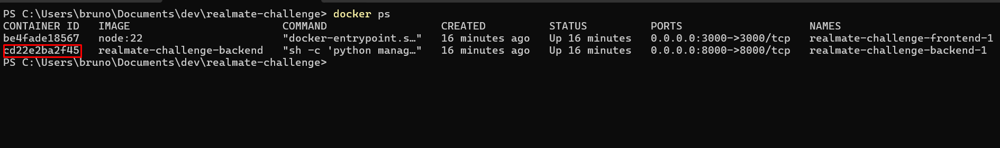
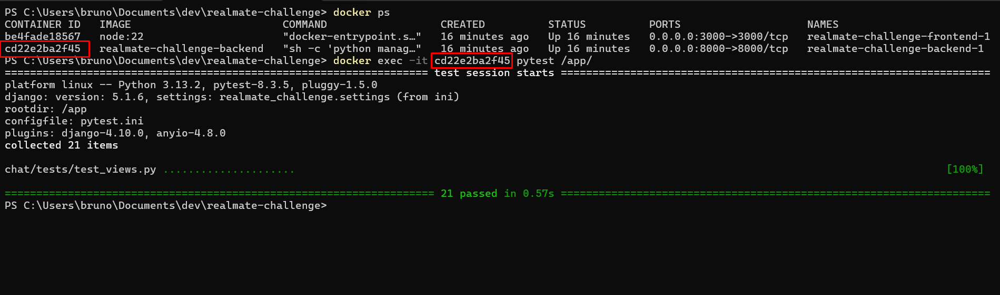

# Realmate Challenge

## Introdução

O objetivo deste desafio é avaliar seus conhecimentos em **APIs** e **Webhooks**, além da sua capacidade de aprender rapidamente e implementar soluções eficientes, usando frameworks renomados como **Django** e **Django Rest Framework (DRF)**.

Você deverá desenvolver uma web API que sincroniza eventos de um sistema de atendimentos no WhatsApp, processando webhooks e registrando as alterações no banco de dados.

---

## 🎯 O Desafio

Desenvolver uma web API utilizando **Django Rest Framework** para receber webhooks de um sistema de atendimento. Esses webhooks contêm eventos relacionados a conversas e mensagens, e devem ser registrados no banco de dados corretamente.

---

## 📌 Requisitos

1. Criar dois modelos principais:
    - `Conversation`
    - `Message` (relacionado a uma `Conversation`)
2. A API deve:
    - Receber eventos via POST no endpoint `localhost/webhook/`
    - Criar instâncias dos modelos correspondentes
3. Criar um endpoint GET em `localhost/conversations/{id}` para expor a conversa, incluindo:
    - Seu estado (`OPEN` ou `CLOSED`)
    - Suas mensagens
4. Lidar com erros de maneira graceful (evitar retornos de erro 500).
5. Restrições:
    - Uma `Conversation` deve ter um estado. Os estados possíveis são: `OPEN` e `CLOSED`
    - Uma `CLOSED` `Conversation` não pode receber novas mensagens
    - Uma `Message` deve ter dois tipos: `SENT` e `RECEIVED`
6. O banco de dados utilizado deve ser SQLite.
7. O código deve ser enviado para um repositório privado no GitHub criado por nós.

---

## 📦 Formato dos Webhooks

Os eventos virão no seguinte formato:

### Novo evento de conversa iniciada

```json
{
    "type": "NEW_CONVERSATION",
    "timestamp": "2025-02-21T10:20:41.349308",
    "data": {
        "id": "6a41b347-8d80-4ce9-84ba-7af66f369f6a"
    }
}
```

### Novo evento de mensagem recebida

```json
{
    "type": "NEW_MESSAGE",
    "timestamp": "2025-02-21T10:20:42.349308",
    "data": {
        "id": "49108c71-4dca-4af3-9f32-61bc745926e2",
        "direction": "RECEIVED",
        "content": "Olá, tudo bem?",
        "conversation_id": "6a41b347-8d80-4ce9-84ba-7af66f369f6a"
    }
}
```

### Novo evento de mensagem enviada

```json
{
    "type": "NEW_MESSAGE",
    "timestamp": "2025-02-21T10:20:44.349308",
    "data": {
        "id": "16b63b04-60de-4257-b1a1-20a5154abc6d",
        "direction": "SENT",
        "content": "Tudo ótimo e você?",
        "conversation_id": "6a41b347-8d80-4ce9-84ba-7af66f369f6a"
    }
}
```

### Novo evento de conversa encerrada

```json
{
    "type": "CLOSE_CONVERSATION",
    "timestamp": "2025-02-21T10:20:45.349308",
    "data": {
        "id": "6a41b347-8d80-4ce9-84ba-7af66f369f6a"
    }
}
```

---

## 📌 Regras de Negócio

- Toda conversa começa no estado “OPEN”
- Uma conversa no estado “CLOSED” não pode receber novas mensagens
- As mensagens devem estar associadas a uma conversa existente
- O ID da mensagem e o ID da conversa devem ser únicos
- O sistema deve lidar com erros sem retornar HTTP 500

---

## 🚀 Como Rodar o Projeto

### 🔧 Rodando back-end Localmente (Sem Docker)

Caso prefira rodar sem Docker, siga estes passos:

#### **Pré-requisitos**
- Instalar o Poetry para gerenciamento de dependências:

```bash
pip install poetry
```

#### **Instalação do Projeto**
1. Clone o repositório e acesse a pasta:

```bash
git clone https://github.com/seu-usuario/realmate-challenge.git
cd realmate-challenge/realmate_challenge_back
```

2. Instale as dependências:

```bash
poetry install
```

3. Aplique as migrações no banco de dados SQLite:

```bash
python manage.py migrate
```

4. Execute o servidor de desenvolvimento:

```bash
python manage.py runserver
```


5. O projeto inclui testes automatizados com pytest. Para executá-los, use o seguinte comando:

```bash
pytest
```


---

### 🔧 Rodando front-end Localmente (Sem Docker)

O frontend deste projeto foi desenvolvido em React. Para instalar e configurar, siga as instruções abaixo:  

➡️ [Guia de Instalação do Frontend](realmate-frontend/README.md)


## 🐋 Rodando com Docker (Recomendado)

Se quiser rodar o projeto de forma simples e sem necessidade de instalar dependências manualmente, utilize o **Docker**.

### **Pré-requisitos**
- Instalar [Docker](https://www.docker.com/get-started)
- Instalar [Docker Compose](https://docs.docker.com/compose/install/)

### **Passos para rodar com Docker**
1. Clone o repositório e acesse a pasta:

```bash
git clone https://github.com/seu-usuario/realmate-challenge.git
cd realmate-challenge
```

2. Suba os containers com:

```bash
docker-compose up --build
```

O backend estará disponível em `http://localhost:8000`.

Para parar os containers:

```bash
docker-compose down
```


3. Executando os Testes com Pytest no Docker

Para rodar os testes automatizados com pytest dentro do Docker, siga os passos abaixo:

Verifique os contêineres em execução:

```bash
docker ps
```
Esse comando exibirá a lista de contêineres em execução no momento. Precisamos do CONTAINER ID do backend, como mostrado na imagem abaixo:



Com o CONTAINER ID em mãos, execute o seguinte comando para rodar os testes dentro do contêiner:

```bash
 docker exec -it <CONTAINER ID> pytest /app/
```

O pytest executará os testes automatizados e exibirá a saída no terminal, conforme exemplo abaixo:




---

## 🎁 Bônus: Vantagens de Usar Docker

- **Facilidade de Configuração**: Apenas rode `docker-compose up`.
- **Ambiente Isolado**: O projeto roda sem interferência no seu sistema operacional.
- **Execução rápida**: Evita problemas de configuração.

---

## 📚 Referências

- [Django Rest Framework](https://www.django-rest-framework.org/)
- [Poetry](https://python-poetry.org/)
- [Docker](https://www.docker.com/)

---

## 📧 Dúvidas

Caso tenha dúvidas, entre em contato no e-mail tecnologia@realmate.com.br.

Boa sorte! 🚀

_Equipe Realmate_

