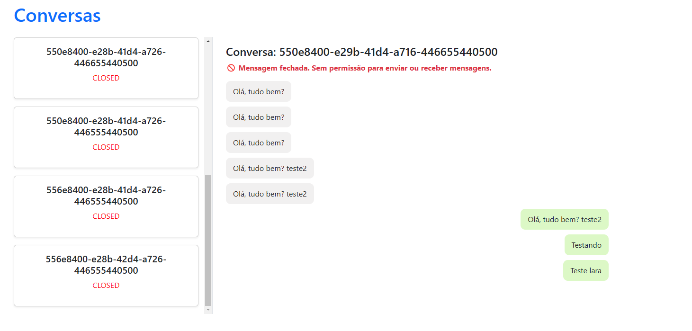
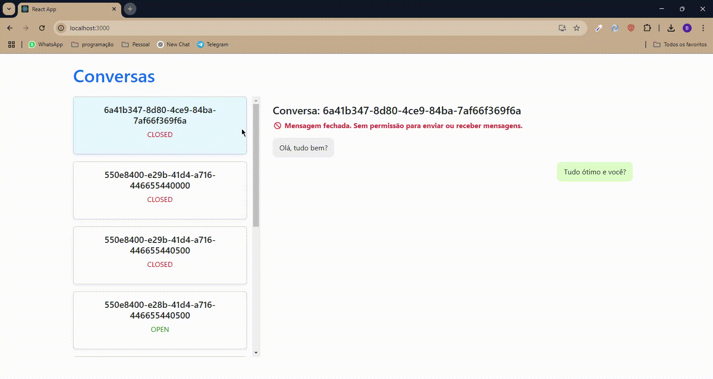
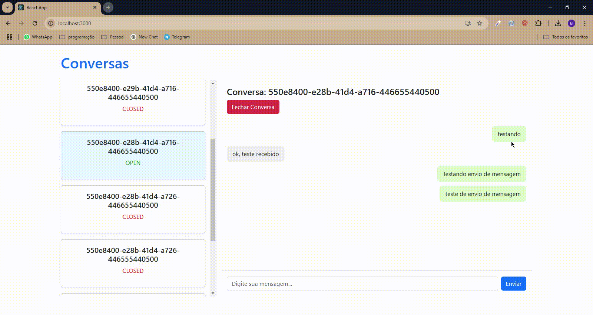

# React Project - Instalação e Configuração

## 📌 Requisitos

Antes de iniciar, certifique-se de ter instalado em sua máquina:

- [Node.js](https://nodejs.org/) (versão recomendada: LTS)
- [Yarn](https://yarnpkg.com/) ou npm

## 📥 Instalação

1. Clone o repositório:

   ```bash
   git clone https://github.com/brunodealmeida17/realmate-challenge
   ```

2. Acesse o diretório do projeto:

   ```bash
   cd realmate-challenge/realmate-frontend
   ```

3. Instale as dependências do projeto:

   ```bash
   yarn install
   ```

   ou, se estiver usando npm:

   ```bash
   npm install
   ```

## 🔧 Configuração

1. Caso necessario alterar a url de comunicação com api em `api.js` em:

   ```bash
   realmate-challenge/realmate-frontend/src/api.js
   const API_BASE_URL = "http://localhost:8000/api";
   ```

2. Edite o arquivo `.env` e configure a URL da API que está rodando:

   ```env
   REACT_APP_API_URL=http://localhost:8000
   ```

## 📸 Pré-visualização

Veja abaixo um exemplo da interface do projeto:



Imagem mostrando a tela inicial da aplicação.



Demonstração prática do envio de uma mensagem pelo front-end.



Demonstração prática do encerramento de uma conversa pelo front-end.

## 🚀 Executando o projeto

Para iniciar o servidor de desenvolvimento, execute:

```bash
yarn start
```

ou, se estiver usando npm:

```bash
npm start
```

O projeto estará disponível em: [http://localhost:3000](http://localhost:3000)

## 📦 Build para Produção

Para gerar os arquivos otimizados para produção, utilize:

```bash
yarn build
```

ou, se estiver usando npm:

```bash
npm run build
```

Os arquivos serão gerados na pasta `build/` e podem ser servidos por um servidor web.

---

Agora seu projeto React está pronto para uso! 🚀

